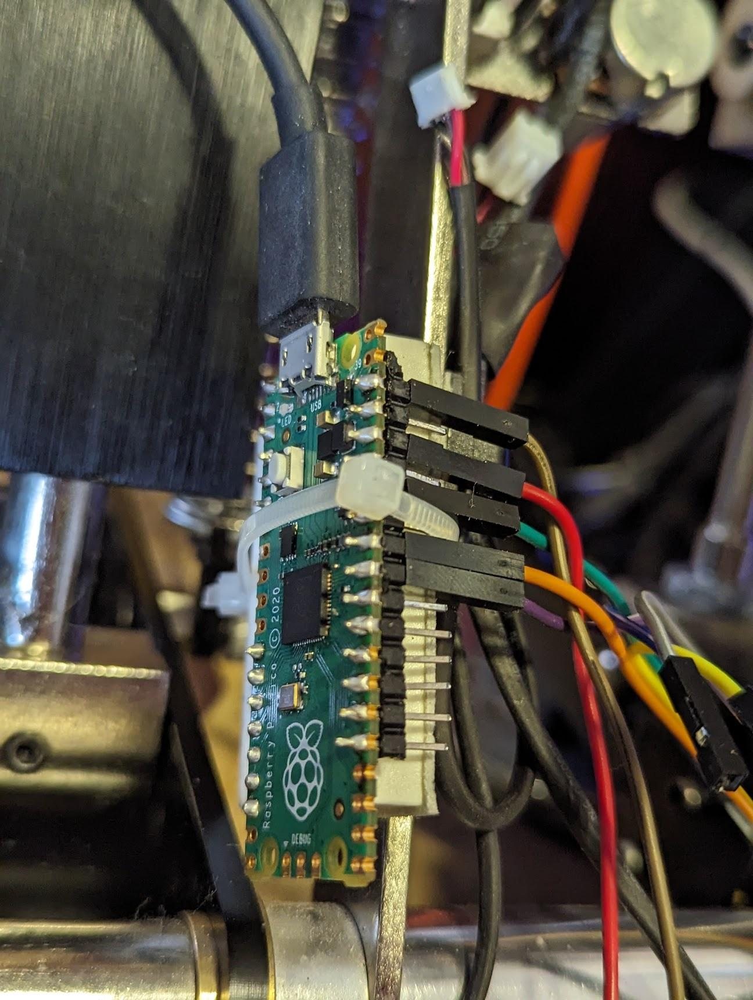

I made it work kind-of (no vibration motor) with a cheap raspberrypi-pico I had laying around.

I did not use Arduino cause I hate C, but used micropython instead. It should work on most cheap ESP32 devices too.
https://www.adafruit.com/category/924

You will need adjusting the PINS in code to your wiring

For the vibration motor it needs some extra power, might look into it one day.
